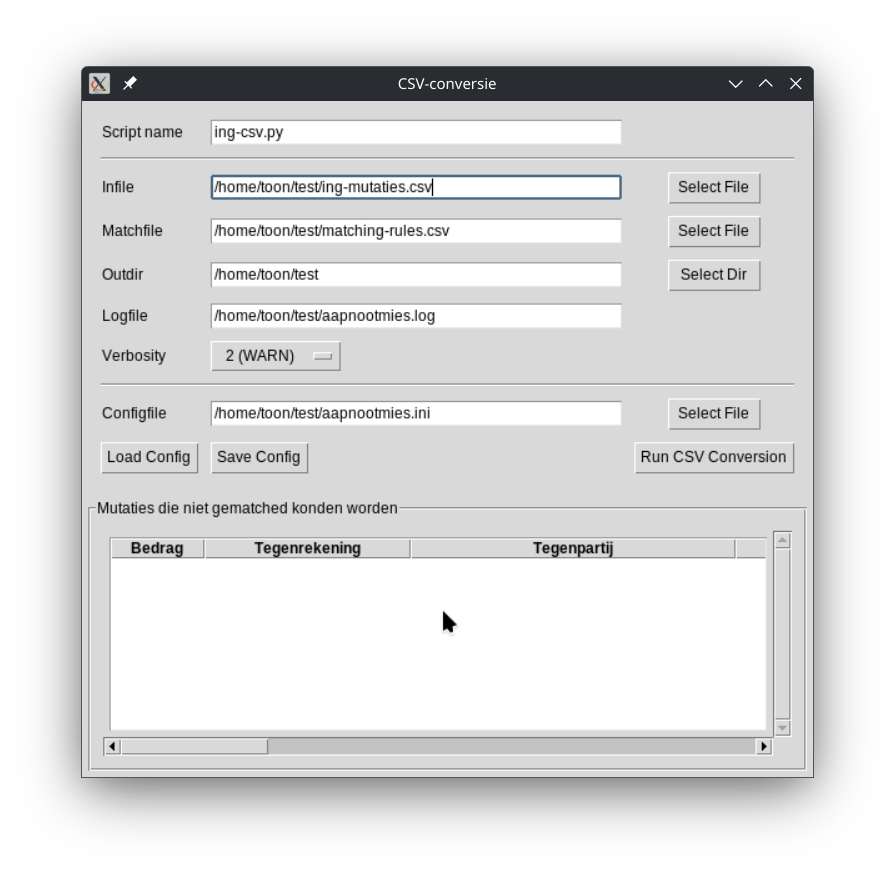
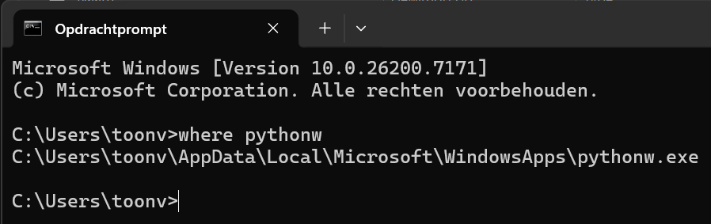
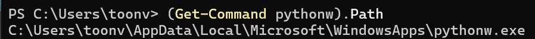

# Grafische gebruikersinterface voor de programma's rabo-csv.py en ing-csv.py
Dit programma biedt een grafische schil over de programma's ```rabo-csv.py``` en ```ing-csv.py```<br>
Om dit programma te kunnen gebruiken dien je dus ook één van die twee programma's te installeren.<br>
Raadpleeg daarvoor de betreffende repositories.

Het prgramma werkt op Linux en Windows.
<br>

Om het programma te gebruiken dien je eenmalig de configuratie in te voeren en op te slaan.  Bij volgende keren volstaat het dan om die configuratie te laden.  De configuratie-items zijn: ```script name```, ```infile```, ```matchfile```, ```outdir```, ```logfile``` en ```verbosity```.  Voor uitleg van deze parameters verwijs ik je naar de repository van ```rabo-csv.py``` of ```ing-csv.py```.

Als je de configuratie eenmaal hebt opgeslagen, kun je in het vervolg het programma via de optie ```--cfgfile``` direct opstarten met deze configuratie.  Alle velden zullen dan al ingevuld zijn, en als die naar je zin zijn kun je meteen de verwerking starten via de knop ```Run CSV Conversion```.  Dit is vooral handig wanneer je voor dit programma een shortcut op de taskbar wilt plaatsen.

> [!NOTE]
> Het veld ```Script name``` dient alléén de bestandsnaam van het script te bevatten, dus **zonder** pad ervoor!  Dat script dient in dezelfde directory te staan als dit programma (```bank-csv-conversie-gui.py```).

Wanneer de configuratie geladen is kan de conversie worden gestart via de knop ```Run CSV Conversion```.  Het script ```Script name``` wordt nu uitgevoerd, waarbij per eigen bankrekening een apart uitvoerbestand in CSV-formaat wordt aangemaakt.  Een eventueel bestaande logfile wordt overschreven.

Na voltooiing scant dit programma de logfile en produceert een handig overzicht van mutaties die niet gematched zijn, en dus niet gerubriceerd konden worden.  Aan de hand van dit overzicht kun je makkelijk de ontbrekende rules toevoegen aan de ```matching-rules.csv```.

## Commandline-argumenten
```
$ bank-csv-conversie-gui.py --help
options:
  -h, --help             show this help message and exit
  --cfgfile CFGFILE      initial INI-file, handy when starting up from a BAT-file
```

## Snelkoppeling/Shortcut op taskbar plaatsen (Windows)
Het is handig om dit programma te kunnen opstarten via een klik op een icoontje.<br>
Hierbij zullen we direct ook een configuratiebestand meegeven, zodat je in de meeste gevallen alleen nog maar het juiste invoerbestend (de infile) hoeft op te geven alvorens de verwerking te starten.

- Maak voor dit programma een directory aan onder je home directory.
  In dit geval kiezen we voor ```C:\users\toonv\ing-csv```
- In deze directory plaatsen we de volgende bestanden:
  - ```ing-csv.py```
  - ```bank-csv-conversie-gui.py```
  - ```matchin-rules.csv```
- Start het programma ```bank-csv-conversie-gui.py```, en vul alle velden in.
  Voor ons voorbeeld sla je de configuatie op onder de naam ```C:\%HOMEPATH%\ing-csv\ing-csv-conversie.ini```

- Open nu een CMD prompt, en type in ```where pythonw```:
  <br>
  Mocht je per abuis een PowerShell-window geopend hebben, dan is het commando ```(Get-Command pythonw).Path```:<br>
  <br>
- Creëer nu (via de rechter muisknop) een nieuwe ```snelkoppeling/shortcut``` in de zojuist aangemaakte directory.<br>
  Bij de vraag naar de locatie van het item vullen we het zojuist opgevraagde pad naar ```pythonw``` in.<br>
  Nu wordt om de naam gevraagd.  Vul hier ```ing-csv-gui``` in en klik op ```Voltooien```.<br>
  In deze shortcut moet het ```Doel/Target``` correct ingevuld worden.<br>
  Open hiertoe (via de rechter muisknop) de ```Eigenschappen/Properties``` van de nieuwe snelkoppeling.<br>
  In het veld ```Doel/Target``` staat het pad naar pythonw reeds ingevuld.<br>
  Hierachter dient het volledige pad naar het programma ```bank-csv-conversie-gui.py``` opgegeven te worden, in ons voorbeeld:<br>
  ```C:\%HOMEPATH%\ing-csv\bank-csv-conversie-gui.py```<br>
  Tot slot volgt de optie ```--cfgfile C:\%HOMEPATH%\ing-csv\ing-csv-conversie.ini```<br>
  Sla de aangepaste snelkoppeling nu op.
- Sleep de aangemaakte snelkoppeling nu naar de taakbalk.<br>
  Eventueel kun je naar smaak zelf een ander icoontje toekennen aan de snelkoppeling.<br>
  Wanneer je nu op het nieuwe icoontje in de taakbalk klikt zal het window van ```bank-csv-conversie-gui.py``` verschijnen.<br>
  Mocht je nog geen configuratiebestand hebben aangemaakt, dan is dit de volgende (eenmalige) stap.<br>
  Dit bestand dient te staan in ```C:\%HOMEPATH%\ing-csv\ing-csv-conversie.ini```
